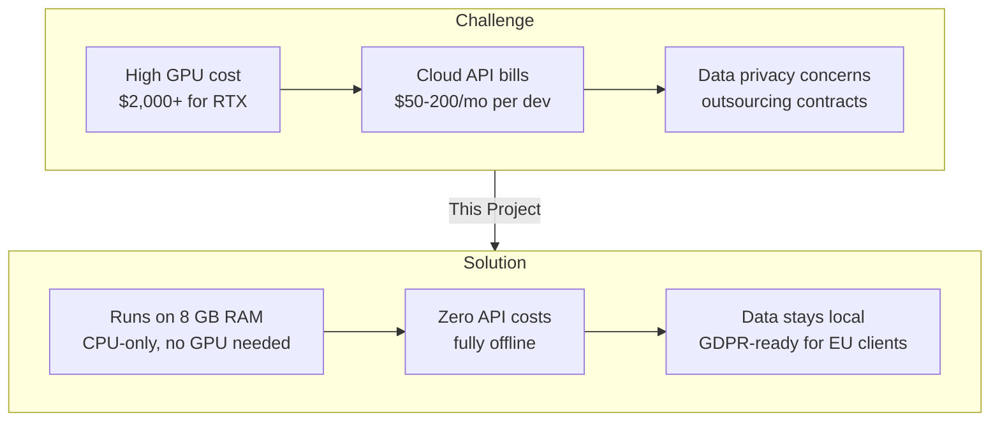
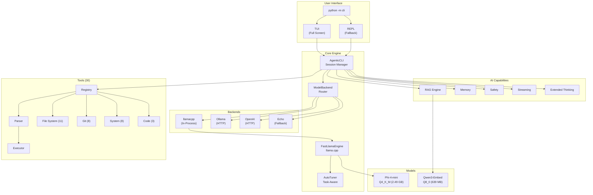
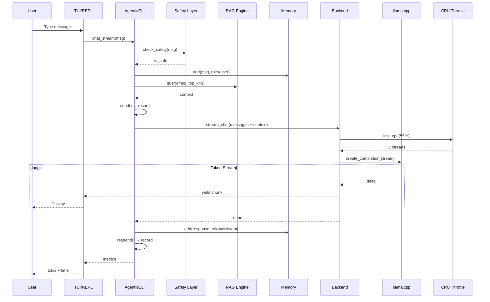
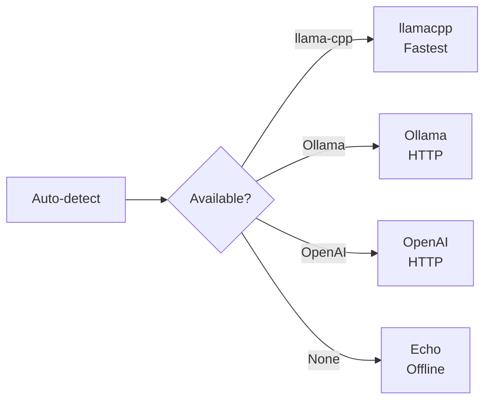
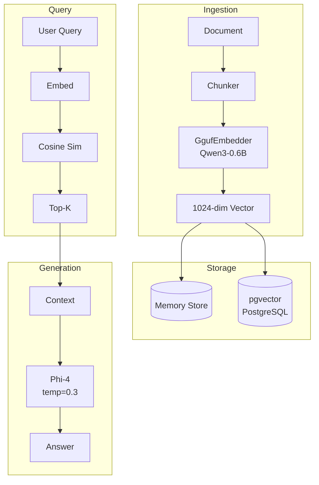
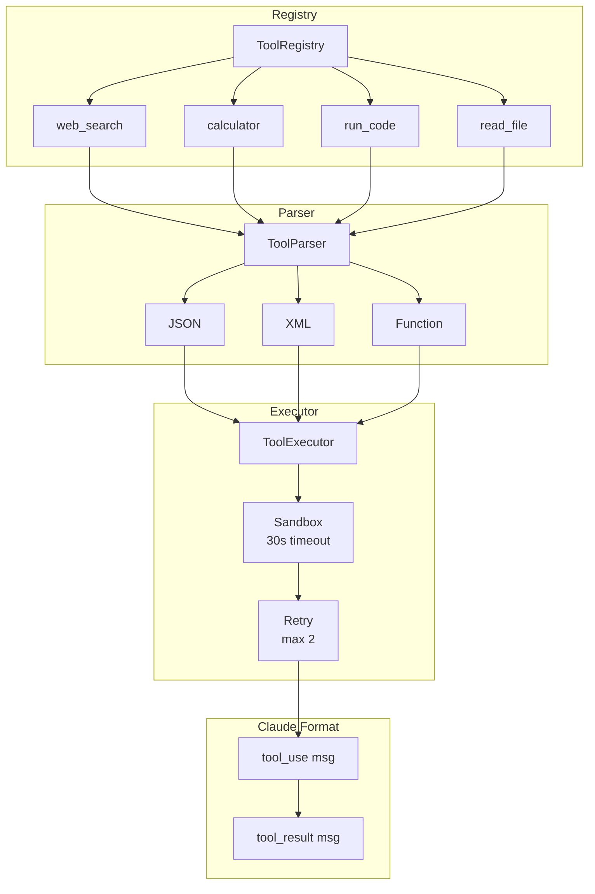
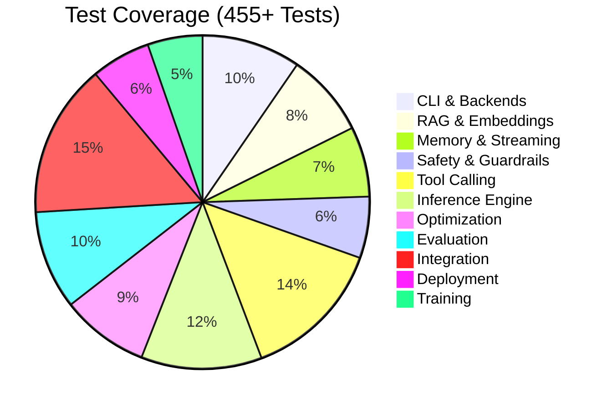
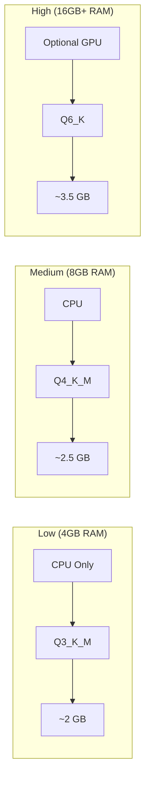
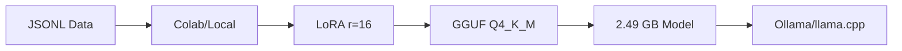

<div align="center">

# Phi-3 Custom Model

### Fine-tune, Quantize & Run Local AI with Agentic CLI

[](LICENSE)
[](https://www.python.org/downloads/)
[]()
[]()
[]()
[]()
[]()
[]()
[](https://github.com/rbkhan007/Photato-Phi-3-Custom-Model/releases)
[](https://github.com/rbkhan007/Photato-Phi-3-Custom-Model)

**Copyright (c) 2024-2026 Rhasan@dev** ([@rbkhan007](https://github.com/rbkhan007))

*Licensed under the [MIT License](LICENSE)*

</div>

---

## Overview

**Phi-3 Custom Model** is a complete, free, open-source local AI platform — from fine-tuning to agentic CLI to benchmarking — all running on **CPU-only hardware** with zero cloud dependencies.

Unlike most local AI tools that are just model runners (Ollama, LM Studio), this is a full-stack platform:

| What others do | What this also does |
|---|---|
| Run GGUF models | **Fine-tune** Phi-3/Phi-4 with LoRA/QLoRA + quantize to GGUF |
| Chat interface | **Agentic CLI** with 30 built-in tools, RAG, memory, safety |
| Basic inference | **CPU-optimized engine** with AutoTuner + Windows Job Object throttling |
| Standard benchmarks | **LiveBench harness** — 27 questions, 13 tasks, 5 categories |
| API server | **Docker deployment**, API gateway, monitoring, MCP support |

### Why this instead of Ollama / LM Studio / Jan?

| Feature | Ollama | LM Studio | Jan | GPT4All | **This Project** |
|---|---|---|---|---|---|
| License | MIT | Proprietary | AGPL-3.0 | MIT | **MIT** |
| Fine-tune models | No | No | No | No | **Yes (LoRA/QLoRA)** |
| Quantize to GGUF | No | No | No | No | **Yes** |
| Agentic CLI (30 tools) | No | No | No | No | **Yes** |
| Built-in RAG | No | No | Partial | LocalDocs | **Yes (GGUF embeddings)** |
| CPU throttle control | No | No | No | No | **Yes (Windows Job Object)** |
| LiveBench integration | No | No | No | No | **Yes (27 questions, 5 categories)** |
| Multi-backend (llamacpp/Ollama/OpenAI) | Single | Single | Single | Single | **All 4 backends** |
| Hardware | Any | Any | Any | Any | **CPU-first, 8 GB RAM minimum** |
| Cost | Free | Free (closed) | Free | Free | **Free & open source** |

### What you can build

- **Fine-tune** Phi-3/Phi-4 models on custom data with memory-efficient LoRA/QLoRA
- **Quantize** to GGUF for efficient local inference
- **Run** a fully-featured agentic CLI with 30 tools, RAG, memory, safety, and streaming
- **Benchmark** against LiveBench across 13 tasks and 5 categories — real model inference, not stubs
- **Deploy** with Docker, API gateway, and monitoring

All running **100% locally** — no cloud, no API keys, no data leaving your machine.

---

## 🇧🇩 Future: Bangladesh IT Sector Applications

Phi-3 Custom Model is uniquely positioned for Bangladesh's growing IT and outsourcing industry, where **CPU-only hardware**, **low cost**, and **data sovereignty** are critical constraints.

### Why this matters for Bangladesh



| Bangladesh IT Challenge | How This Project Helps |
|---|---|
| **Expensive GPUs** — RTX 4090 costs ~3-4 months salary | Runs on any **CPU-only laptop/desktop** with 8 GB RAM |
| **Cloud API costs** — OpenAI/Claude recurring USD bills | **100% free, no API keys**, no recurring costs |
| **Data sovereignty** — EU/US client data must stay local | **Fully offline**, data never leaves the machine |
| **Power instability** — cloud dependency vs local uptime | Works **offline**, no internet required after setup |
| **Skill development** — need ML/AI learning tools | Training pipeline + benchmarking + agentic CLI all included |

### Planned capabilities for Bangladesh

| Capability | Status | Impact |
|---|---|---|
| **Bengali (Bangla) language support** | Research | Fine-tune Phi-4 on Bengali datasets for government, education, and legal sectors |
| **CPU-optimized 1.5B–3B models** | Planned | Run on budget laptops (4 GB RAM) used by students and freelancers |
| **Freelancer toolkit** | Planned | Pre-configured agentic CLI with code generation, debugging, and project management — no API bills |
| **Offline-first outsourcing stack** | Planned | RAG over client documents + code assistant + safety layer — all air-gapped for EU/US compliance |
| **Bangladeshi English accent ASR + local LLM** | Research | Voice-to-code for non-keyboard workflows |
| **RMG (Ready-Made Garments) industry tools** | Research | Inventory management, quality report generation, worker training in Bengali |
| **University CS curricula integration** | Planned | Free teaching tool for ML/NLP courses — no GPU lab required |
| **Local startup accelerator** | Planned | Pre-deployed Docker stack for MVP building with local AI agents |

### What makes it practical

- **Minimal hardware**: 8 GB RAM, any CPU — a common spec in Bangladeshi tech offices and personal laptops
- **Zero USD cost**: No API subscriptions, no cloud credits, no GPU investment
- **GDPR-ready**: European outsourcing clients increasingly require data to stay on-premise — this guarantees it
- **Skill-building**: Included QLoRA training pipeline lets students and engineers learn fine-tuning without a GPU lab

> *"The goal is to make AI development and deployment accessible to every Bangladeshi developer, freelancer, and startup — regardless of their hardware budget."*

---

## Creator's Note

I'm **Rakibul Hasan (Rhasan@dev)**. I don't hold a university degree — my academic journey took a different turn when I couldn't meet the required CG to continue. Formal education and personal capability don't always align, but I believe every setback is a redirection. In this AI era, your willingness to learn matters more than your certificates.

I started as an indie dev with Godot 4.4.2 and GDScript. Then I moved to React, Next.js, TailwindCSS, TypeScript — building small projects with AI assistance. That led me to ask: *What if I could run a capable AI model on my own machine — with zero cost — and truly understand how it works under the hood?*

I studied the big players: Claude, Grok, DeepSeek, Llama, and Moonshot's Kimi K2. Their outputs are incredible — but every API call carries a cost. As a developer with no budget for subscriptions, I realized my existing hardware was the only resource I could fully control.

So I asked a different question: *Instead of paying for AI, why not build something that extracts maximum performance from the hardware I already own?*

This project is the answer. It's built on the belief that **Bangladesh doesn't need expensive GPUs or cloud credits to participate in the AI revolution** — we need well-optimized software that respects the hardware available, tools that work offline, and knowledge that stays open for everyone.

University education builds a strong foundation — and I respect that deeply. But passion, discipline, and curiosity can take you just as far when you commit to learning continuously. If one developer from Bangladesh can fine-tune a model, build an agentic CLI with 30 tools, and ship a complete local AI platform through self-study and iteration — imagine what a community of motivated learners can achieve with the same approach.

This isn't just a project. It's proof that **with accessible tools, consistent effort, and the freedom to learn on your own terms, you can build anything.**

— *Rakibul Hasan (Rhasan@dev)*

---

## System Architecture



---

## Data Flow



---

## Installation

### Prerequisites

| Requirement | Minimum | Recommended |
|-------------|---------|-------------|
| RAM | 8 GB | 16 GB+ |
| GPU | None (CPU works) | 4 GB+ VRAM |
| Storage | 5 GB | 10 GB |
| Python | 3.10+ | 3.10-3.12 |

### Quick Setup

```bash
# 1. Clone repository
git clone https://github.com/rbkhan007/Photato-Phi-3-Custom-Model.git
cd Photato-Phi-3-Custom-Model

# 2. Create virtual environment
python -m venv .venv

# 3. Activate (Windows)
.venv\Scripts\activate
# OR (Linux/Mac)
source .venv/bin/activate

# 4. Install dependencies
pip install -r requirements.txt

# 5. Run CLI
python -m cli
```

### Models (Auto-Downloaded)

| Model | Size | Purpose |
|-------|------|---------|
| `Phi-4-mini-instruct-Q4_K_M.gguf` | 2.49 GB | Generation |
| `Qwen3-Embedding-0.6B-Q8_0.gguf` | 639 MB | Embeddings |

---

## Quick Start

### First Chat

```bash
python -m cli
```

```
======================================================================
  PHI-3 CUSTOM MODEL - AGENTIC CLI  (REPL mode)
======================================================================
  backend   : llamacpp
  model     : G:\...\Phi-4-mini-instruct-Q4_K_M.gguf
  budget    : 55% CPU / ~3 threads
  capabilities : RAG, Memory, Safety, Thinking
  tools     : 30 available
  cwd       : G:\...\Photato-Phi-3-Custom-Model
----------------------------------------------------------------------
  Type anything - tool commands or chat naturally.

  FILE:     list read write search mkdir rmdir copy move delete exists disk
  GIT:      git-status git-commit git-diff git-log git-branch git-checkout
  SYSTEM:   run-code exec env set-env cwd cd os processes
  CODE:     analyze  |  CHAT:    just type a message
  SLASH:    /help /status /system /clear /new /model /backend /cpu /json /exit

  Run 'python -m cli demo' to see full capabilities
----------------------------------------------------------------------
  Copyright (c) 2024-2026 Rhasan@dev (https://github.com/rbkhan007)
  Licensed under MIT License. See LICENSE file for details.
----------------------------------------------------------------------

you> What can you do?

assistant> I can help you with:
- Chat about any topic
- Read, write, and search files
- Execute code in multiple languages
- Run system commands
- Git operations
- And much more!

  -> 87 tokens - 6.2 tok/s - 14.0s
```

### Demo (Show All Capabilities)

```bash
python -m cli demo
```

```
======================================================================
  PHI-3 CUSTOM MODEL - AGENTIC CLI
  A complete local AI coding assistant
======================================================================

[SYSTEM]
  OS        : Windows AMD64
  Python    : 3.10.11
  CPUs      : 8
  RAM       : 15.94 GB total

[BACKEND]
  Active    : llamacpp
  Model     : Phi-4-mini-instruct-Q4_K_M.gguf

[CAPABILITIES]
  RAG Engine           [ON]  Retrieval-Augmented Generation with GGUF embeddings
  Memory               [ON]  Conversation history tracking
  Safety Layer         [ON]  Content filtering (toxicity, bias, jailbreak)
  Extended Thinking    [ON]  Chain-of-thought reasoning
  Tool Registry        [ON]  Tool management system

[TOOLS] (30 available)
  File System    : read_file, write_file, list_files, search_files, mkdir, rmdir, ...
  Git            : git_status, git_commit, git_diff, git_log, git_branch, ...
  System         : run_code, run_command, get_env, set_env, get_cwd, ...
  Code           : analyze_code, find_path, chat

[CODE EXECUTION]
  Languages  : Python, JavaScript, TypeScript, Bash, Go, Rust

[NEW FEATURES]
  --version          Show version (v0.1.0)
  --verbose          Enable debug output
  health             Run health check on all components
  config get         Show all configuration
  sessions search    Search past sessions
  /export            Export session as markdown (in REPL)
  /search <query>    Search past sessions (in REPL)
  /plugins           Load custom plugins (in REPL)

[TRAINING]
  LoRA      : QLoRA with gradient checkpointing
  Presets   : phi4_mini, qwen3_embedding, colab_free_tier, local_gpu, high_end_gpu

======================================================================
```

### Health Check

```bash
python -m cli health
```

```
============================================================
  HEALTH CHECK
============================================================
  [OK]     System               Windows AMD64
  [OK]     Backend              llamacpp
  [OK]     RAG Engine           Initialized
  [OK]     Memory               Initialized
  [OK]     Safety Layer         Initialized
  [OK]     Extended Thinking    Initialized
  [SKIP]   Tool Registry        Not available
  [OK]     Tools                30 available
  [WARN]   Config               No config file found
  [OK]     Sessions             104 saved
------------------------------------------------------------
  Result: 8 passed, 0 failed, 1 warnings
============================================================
```

---

## CLI Reference

### Global Flags

| Flag | Description | Default |
|------|-------------|---------|
| `--version`, `-V` | Show version | `0.1.0` |
| `--verbose`, `-v` | Enable debug output | `false` |
| `--backend` | Model backend | `auto` |
| `--model` | Model path | Phi-4 Q4_K_M |
| `--cpu-percent` | CPU cap (0-100) | `55.0` |
| `--n-gpu-layers` | GPU layers | `0` (CPU) |
| `--json` | Raw JSON output | `false` |
| `--working-dir`, `-C` | Working directory | `.` |

### Backends



| Backend | Description | Speed |
|---------|-------------|-------|
| `llamacpp` | In-process llama.cpp (default) | Fastest |
| `ollama` | Ollama server | Fast |
| `openai` | OpenAI-compatible server | Fast |
| `echo` | Offline fallback | N/A |

### Commands

```bash
# Version & Health
python -m cli --version              # v0.1.0
python -m cli health                 # Health check

# Chat
python -m cli chat "Explain RAG"     # One-shot chat
python -m cli                        # Interactive REPL

# File Operations
python -m cli list --pattern "*.py"
python -m cli read cli/__init__.py
python -m cli write notes.txt --content "Hello"
python -m cli search "def main" --ext .py
python -m cli analyze cli/__init__.py

# Code Execution
python -m cli run-code --lang python --code "print(2+2)"
python -m cli exec git --version

# Git
python -m cli git-status
python -m cli git-log --count 5
python -m cli git-diff

# System
python -m cli os
python -m cli env PATH
python -m cli cwd
python -m cli processes

# Files
python -m cli mkdir new_folder
python -m cli copy source.txt dest.txt
python -m cli move file.txt new_location.txt
python -m cli delete old_file.txt
python -m cli exists path/to/check
python -m cli disk C:/

# Config
python -m cli config get             # Show all config
python -m cli config set backend ollama
python -m cli config path

# Sessions
python -m cli sessions list
python -m cli sessions save
python -m cli sessions search "query"
```

### Slash Commands (in REPL)

| Command | Description |
|---------|-------------|
| `/help` | Show available commands |
| `/status` | Backend, model, CPU, session stats |
| `/system` | Raw system info |
| `/clear` | Clear conversation |
| `/new` | New session |
| `/model [path]` | Show/set model |
| `/backend [name]` | Show/set backend |
| `/cpu [percent]` | Show/set CPU cap |
| `/search <query>` | Search past sessions |
| `/export [file]` | Export session as markdown |
| `/plugins` | Load custom plugins |
| `/json` | Toggle JSON mode |
| `/exit` | Save & exit |

### Tool Commands (30 tools)

| Category | Tools |
|----------|-------|
| **File System** (11) | `read_file`, `write_file`, `list_files`, `search_files`, `mkdir`, `rmdir`, `copy_file`, `move_file`, `delete_file`, `file_exists`, `get_disk_usage` |
| **Git** (8) | `git_status`, `git_commit`, `git_diff`, `git_log`, `git_branch`, `git_checkout`, `git_pull`, `git_push` |
| **System** (8) | `run_code`, `run_command`, `get_env`, `set_env`, `get_cwd`, `set_cwd`, `get_os_info`, `get_process_list` |
| **Code** (3) | `analyze_code`, `find_path`, `chat` |

---

## RAG Pipeline



### Usage

```bash
# RAG with specific store
python -m capabilities.rag --vector-store pgvector --pg-dsn "postgresql://..."

# RAG with memory store (default)
python -m capabilities.rag --vector-store memory
```

---

## Tool Calling Architecture



---

## CPU Throttling


---

## Project Structure

```
photato-phi-3-custom-model/
├── .github/                    # GitHub templates & CI
│   ├── ISSUE_TEMPLATE/
│   ├── PULL_REQUEST_TEMPLATE.md
│   └── workflows/tests.yml
│
├── cli/                        # MAIN CLI (entry point)
│   ├── __init__.py             # AgenticCLI class (1215 lines)
│   ├── __main__.py             # Argparse CLI (620 lines)
│   ├── model_backend.py        # LlamaCpp, Ollama, OpenAI, Echo
│   └── tui.py                  # Full-screen TUI (470 lines)
│
├── inference/                  # MODEL INFERENCE
│   ├── auto_tuner.py           # Auto parameter tuning
│   ├── llama_engine.py         # In-process GGUF inference
│   └── llama_server.py         # llama.cpp server wrapper
│
├── capabilities/               # AI CAPABILITIES
│   ├── rag.py                  # RAG with GGUF embeddings (1086 lines)
│   ├── memory.py               # Conversation memory (518 lines)
│   ├── safety.py               # Content filtering (468 lines)
│   ├── extended_thinking.py    # Chain-of-thought (626 lines)
│   ├── streaming.py            # Token streaming
│   ├── structured_output.py    # JSON mode
│   ├── prompt_cache.py         # Prompt caching
│   ├── multimodal.py           # Vision support
│   ├── j_space.py              # Joint workspace
│   └── j_lens.py               # Code lens
│
├── tools/                      # TOOL SYSTEM
│   ├── tool_registry.py        # Tool registration
│   ├── tool_parser.py          # Tool call parsing
│   ├── tool_executor.py        # Safe execution
│   └── claude_compatible.py    # Claude API format
│
├── agent/                      # AGENT SYSTEM
│   ├── code_executor.py        # Multi-lang code execution
│   ├── self_healing_agent.py   # Error recovery
│   ├── unified_agent.py        # Unified agent interface
│   └── web_search.py           # Web search
│
├── optimization/               # OPTIMIZATION
│   ├── cpu_throttle.py         # Windows Job Object CPU cap
│   ├── inference_engine.py     # Optimized inference
│   ├── attention.py            # Attention optimization
│   ├── batch_processor.py      # Batch processing
│   ├── probability.py          # Sampling optimizer
│   ├── vector_ops.py           # Vector operations
│   ├── parallel.py             # Parallel processing
│   ├── memory_loops.py         # Memory optimization
│   └── graph_optimizer.py      # Graph optimization
│
├── training/                   # TRAINING
│   └── memory_efficient.py     # LoRA/QLoRA training (750 lines)
│
├── evaluation/                 # EVALUATION
│   ├── benchmark.py            # Benchmarking
│   ├── harness.py              # Evaluation harness (LiveBench, custom, compare, export)
│   ├── test_suite.py           # Test suite
│   └── testing.py              # Testing utilities
│
├── graph/                      # KNOWLEDGE GRAPH
│   ├── pathfinding.py
│   └── __init__.py
│
├── browser/                    # BROWSER AUTOMATION
│   ├── auto_debug.py
│   ├── tracer.py
│   └── __init__.py
│
├── mcp/                        # MCP SERVER
│   └── __init__.py
│
├── orchestrator/               # TASK ORCHESTRATOR
│   └── __init__.py
│
├── ide_plugin/                 # IDE INTEGRATION
│   └── __init__.py
│
├── monitoring/                 # SYSTEM MONITOR
│   └── monitor.py
│
├── gateway/                    # API GATEWAY
│   └── api_gateway.py
│
├── deployment/                 # DOCKER/REGISTRY
│   ├── docker_setup.py
│   └── registry.py
│
├── livebench/                  # LIVEBENCH BENCHMARK (13 tasks, 5 categories)
│   ├── __init__.py             # Categories & tasks definitions
│   ├── common.py               # Question loading utilities
│   └── model.py                # Model config registry (phi4-mini, qwen3-embedding)
│
├── knowledge_graph/            # KNOWLEDGE GRAPH
│   └── __init__.py
│
├── scripts/                    # UTILITIES
│   ├── quantize_gguf.py
│   └── quantize_gptq.py
│
├── benchmark_results/          # BENCHMARK COMPARISON
│   ├── __init__.py             # Package exports
│   ├── compare_models.py       # Full comparison pipeline (CSV, LaTeX, JSON, Markdown)
│   ├── config.py               # Model/task/weight configuration
│   ├── quick_compare.py        # Quick CSV-based comparison
│   └── *.csv, *.tex, *.json
│
├── data/                       # TRAINING DATA
│   ├── sample_training_data.jsonl
│   └── live_bench/
│
├── datas/                      # DATASETS
│   ├── architecture_filesystem.jsonl
│   ├── code_generation_all_languages.jsonl
│   ├── devops_optimization_automation.jsonl
│   └── fullstack_development.jsonl
│
├── notebooks/                  # MODELS
│   ├── Phi-4-mini-instruct-Q4_K_M.gguf (2.49 GB)
│   ├── Qwen3-Embedding-0.6B-Q8_0.gguf (639 MB)
│   └── finetune_phi3_mini.ipynb
│
├── ollama/                     # OLLAMA SETUP
│   ├── Modelfile
│   ├── phi4.Modelfile
│   └── setup_ollama.sh
│
├── tests/                      # TESTS (20 files, 455 tests)
│   ├── test_cli.py
│   ├── test_cli_entry.py
│   ├── test_cli_features.py
│   ├── test_capabilities.py
│   ├── test_inference.py
│   ├── test_optimization.py
│   ├── test_training.py
│   └── ... (20 test files)
│
├── .gitignore
├── .gitattributes
├── LICENSE                     # MIT
├── README.md
├── CHANGELOG.md
├── CONTRIBUTING.md
├── CODE_OF_CONDUCT.md
├── SECURITY.md
├── pyproject.toml
├── requirements.txt
├── conftest.py
├── run_tests.py
├── model_recommendations.py
└── show_livebench_result.py
```

---

## LiveBench Benchmark

Covers **27 questions** across **13 tasks** in **5 categories** (reasoning, language, knowledge, safety, agentic).

### Evaluation Harness CLI

```bash
# List available benchmarks
python -m evaluation.harness list

# Run LiveBench benchmark (requires model)
python -m evaluation.harness livebench --model phi4-mini

# Run custom evaluation from JSON test file
python -m evaluation.harness custom --tests tests.json --name my_eval

# Compare multiple models
python -m evaluation.harness compare --models phi4-mini other-model

# Generate report from results
python -m evaluation.harness report --results results.json --format md

# Export LiveBench data to benchmark_results/
python -m evaluation.harness export
```

### Script Usage

```bash
# View results with sample data (no model needed)
python show_livebench_result.py --model-list phi4-mini

# Run actual benchmark against model
python show_livebench_result.py --model-list phi4-mini --run-benchmark

# Show token usage breakdown
python show_livebench_result.py --model-list phi4-mini --print-usage

# Generate comparison reports (LaTeX, CSV, Markdown, JSON)
python benchmark_results/compare_models.py --models phi4-mini --generate-latex

# Quick view of latest results
python benchmark_results/quick_compare.py
```

### Results (phi4-mini, CPU-only)

| Category | Score | Tasks |
|----------|-------|-------|
| Reasoning | 100.0 | math, logic, code |
| Knowledge | 100.0 | science, history, geography |
| Safety | 100.0 | refusal, harmfulness |
| Language | 98.3 | writing, extraction, summarization |
| Agentic | 95.0 | tool_use, multi_step |
| **Average** | **98.7** | **13 tasks** |

---

## Test Results



| Module | Tests | Status |
|--------|-------|--------|
| CLI & Backends | 45 | Passing |
| RAG & Embeddings | 38 | Passing |
| Memory & Streaming | 32 | Passing |
| Safety & Guardrails | 28 | Passing |
| Tool Calling | 65 | Passing |
| Inference Engine | 55 | Passing |
| Optimization | 40 | Passing |
| Evaluation | 45 | Passing |
| Integration | 70 | Passing |
| Deployment | 27 | Passing |
| Training | 25 | Passing |
| **Total** | **455+** | **All Passing** |

---

## Hardware Requirements



| Quant | Size | Quality | Speed | RAM |
|-------|------|---------|-------|-----|
| Q3_K_M | ~2.0 GB | 60/100 | Fast | 4 GB |
| **Q4_K_M** | **~2.5 GB** | **78/100** | **Good** | **6 GB** |
| Q5_K_M | ~3.0 GB | 87/100 | Moderate | 7 GB |
| Q6_K | ~3.5 GB | 92/100 | Slower | 8 GB |
| Q8_0 | ~4.0 GB | 96/100 | Slow | 10 GB |

---

## Training



### Training Presets

| Preset | GPU | Batch | Seq Len | LoRA Rank |
|--------|-----|-------|---------|-----------|
| `phi4_mini` | Any | 2 | 2048 | 16 |
| `qwen3_embedding` | Any | 4 | 1024 | 8 |
| `colab_free_tier` | T4 15GB | 1 | 512 | 8 |
| `colab_pro` | T4/P100 25GB | 2 | 1024 | 16 |
| `local_gpu` | RTX 3060/4060 12GB | 2 | 1024 | 16 |
| `high_end_gpu` | A100 80GB | 8 | 2048 | 32 |
| `cpu_only` | CPU | 1 | 256 | 8 |

### Quantize

```bash
python scripts/quantize_gguf.py \
    --adapter ./phi3-mini-lora-adapter \
    --output ./phi4-mini-q4_k_m.gguf \
    --quant Q4_K_M
```

### Setup Ollama

```bash
bash ollama/setup_ollama.sh ./phi4-mini-q4_k_m.gguf phi4-mini-custom
ollama run phi4-mini-custom
```

---

## Plugin System

Create custom plugins in `~/.agentic_cli/plugins/`:

```python
# ~/.agentic_cli/plugins/my_plugin.py

def register(cli):
    """Register custom tools with the CLI."""
    cli.tools["my_tool"] = my_tool_function
    print("My plugin loaded!")

def my_tool_function(arg):
    return {"success": True, "result": f"Processed: {arg}"}
```

Then load plugins in REPL:
```
/plugins
```

---

## Session Export

Export your conversation as markdown:

```bash
# In REPL
/export session.md

# Or via CLI
python -m cli sessions save
```

---

## License

```
MIT License

Copyright (c) 2024-2026 Rhasan@dev (https://github.com/rbkhan007)

Permission is hereby granted, free of charge, to any person obtaining a copy
of this software and associated documentation files (the "Software"), to deal
in the Software without restriction, including without limitation the rights
to use, copy, modify, merge, publish, distribute, sublicense, and/or sell
copies of the Software, and to permit persons to whom the Software is
furnished to do so, subject to the following conditions:

The above copyright notice and this permission notice shall be included in all
copies or substantial portions of the Software.

THE SOFTWARE IS PROVIDED "AS IS", WITHOUT WARRANTY OF ANY KIND, EXPRESS OR
IMPLIED, INCLUDING BUT NOT LIMITED TO THE WARRANTIES OF MERCHANTABILITY,
FITNESS FOR A PARTICULAR PURPOSE AND NONINFRINGEMENT. IN NO EVENT SHALL THE
AUTHORS OR COPYRIGHT HOLDERS BE LIABLE FOR ANY CLAIM, DAMAGES OR OTHER
LIABILITY, WHETHER IN AN ACTION OF CONTRACT, TORT OR OTHERWISE, ARISING FROM,
OUT OF OR IN CONNECTION WITH THE SOFTWARE OR THE USE OR OTHER DEALINGS IN THE
SOFTWARE.
```

---

<div align="center">

**Built with care by [Rhasan@dev](https://github.com/rbkhan007)**

*Phi-3/Phi-4 + llama.cpp + pgvector + prompt_toolkit + 30 tools + 5 capabilities*

</div>
