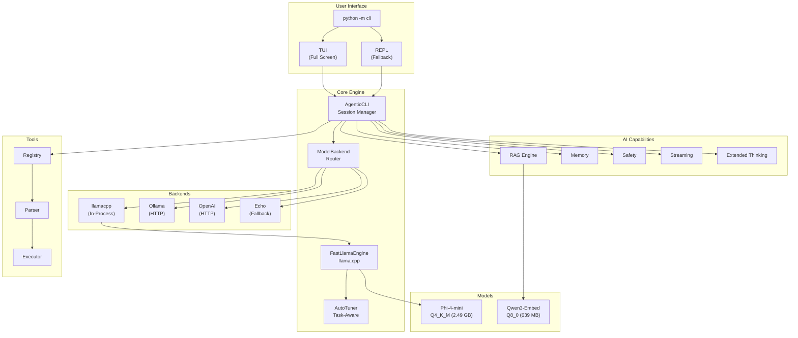
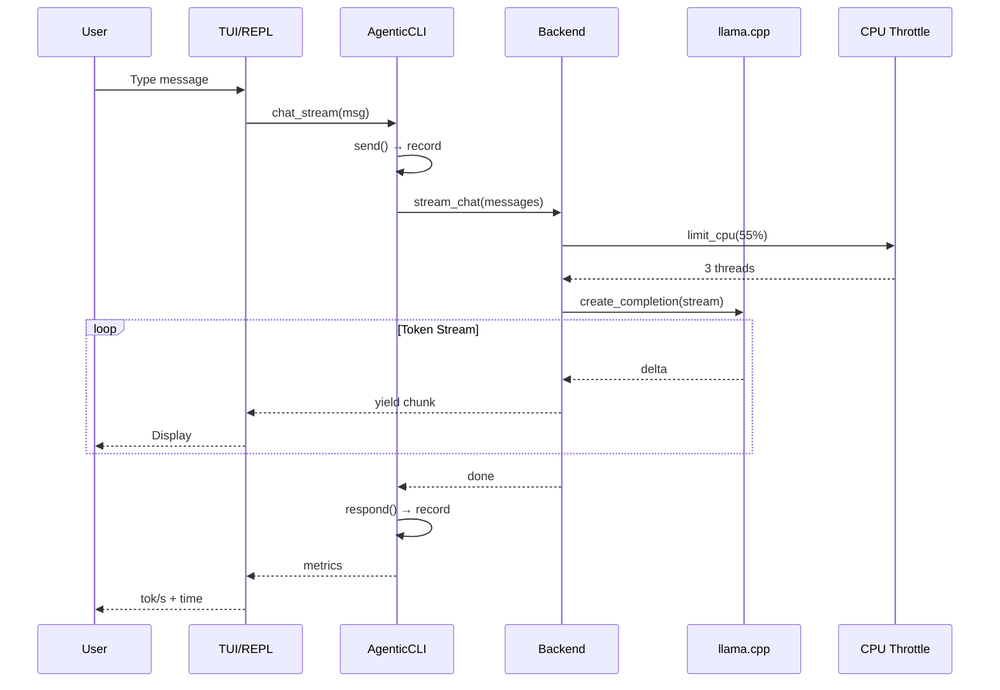
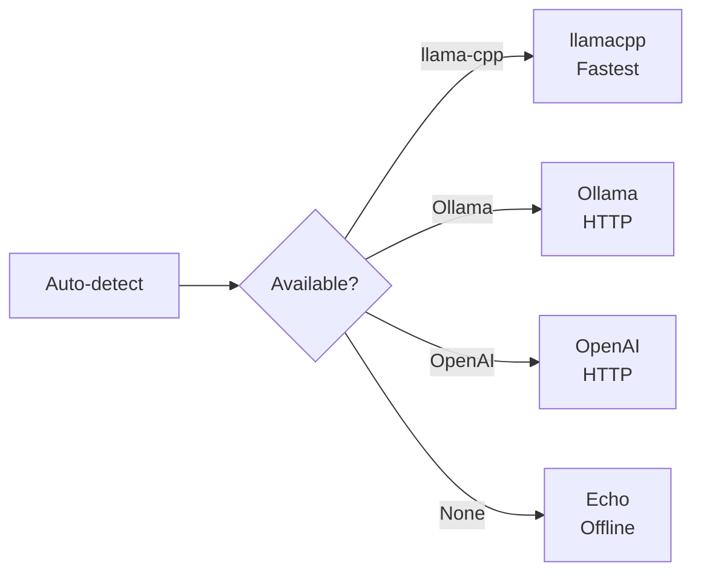
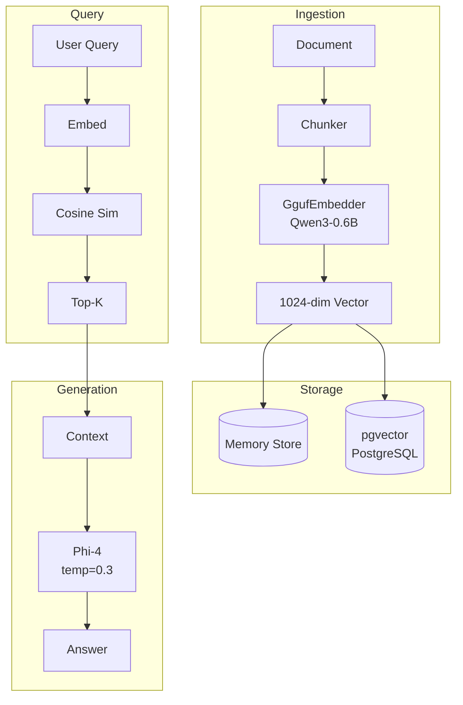
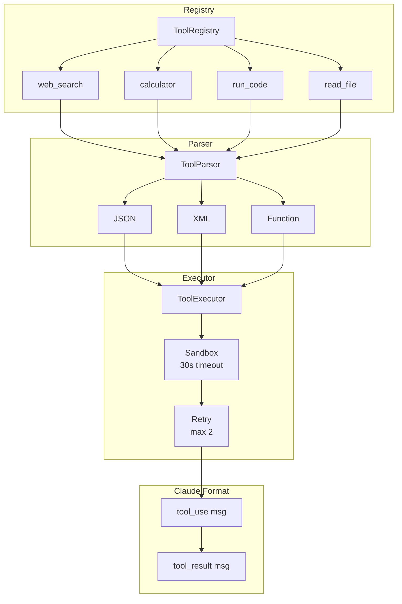
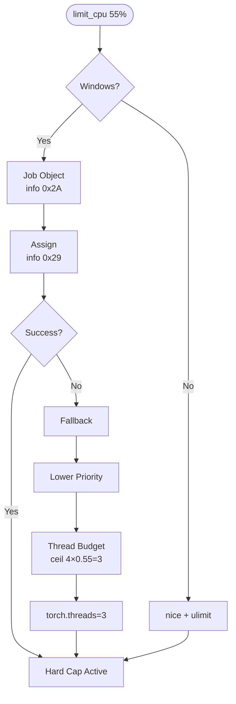
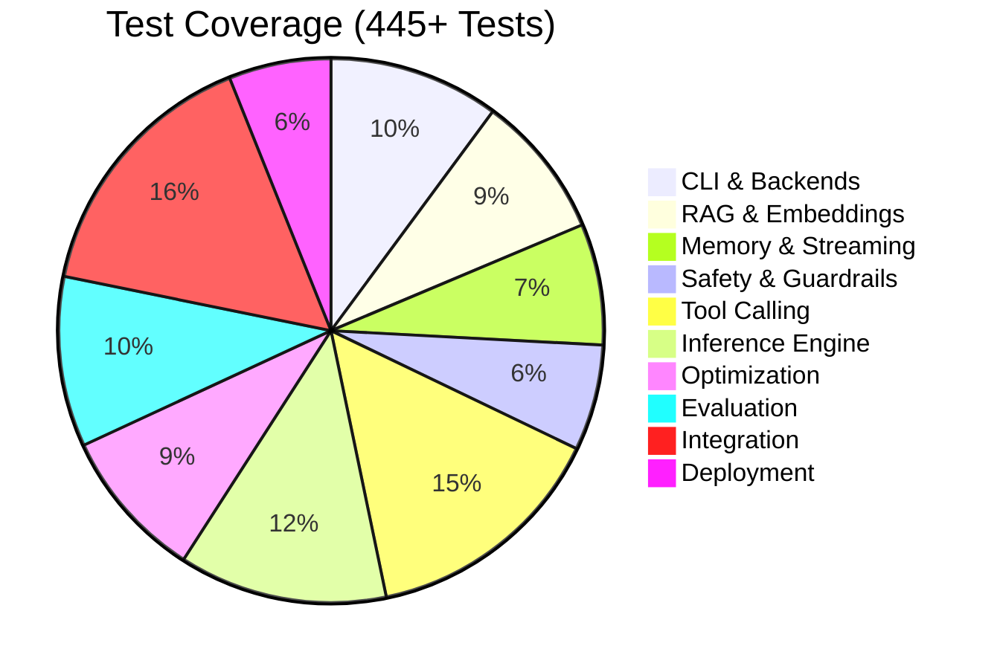
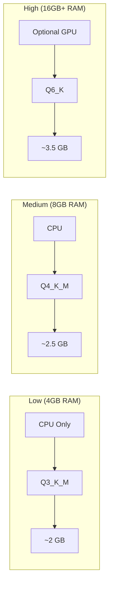
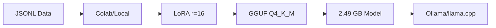

<div align="center">

# Phi-3 Custom Model

### Fine-tune, Quantize & Run Local AI with Agentic CLI

[](LICENSE)
[](https://www.python.org/downloads/)
[]()
[]()
[]()
[]()

**Copyright (c) 2024-2026 Rhasan@dev** ([@rbkhan007](https://github.com/rbkhan007))

*Licensed under the [MIT License](LICENSE)*

</div>

---

## Overview

Phi-3 Custom Model is a complete local AI platform that lets you:

- **Fine-tune** Phi-3/Phi-4 models on custom data
- **Quantize** to GGUF format for efficient local inference
- **Run** a fully-featured agentic CLI with tool calling, RAG, and streaming
- **Benchmark** against LiveBench to measure performance
- **Deploy** with Docker, API gateway, and monitoring

All running **100% locally** — no cloud, no API keys, no data leaving your machine.

---

## System Architecture



---

## Data Flow



---

## Installation

### Prerequisites

| Requirement | Minimum | Recommended |
|-------------|---------|-------------|
| RAM | 8 GB | 16 GB+ |
| GPU | None (CPU works) | 4 GB+ VRAM |
| Storage | 5 GB | 10 GB |
| Python | 3.10+ | 3.10-3.12 |

### Quick Setup

```bash
# 1. Clone repository
git clone https://github.com/rbkhan007/Phi-3-Custom-Model.git
cd Phi-3-Custom-Model

# 2. Create virtual environment
python -m venv .venv

# 3. Activate (Windows)
.venv\Scripts\activate
# OR (Linux/Mac)
source .venv/bin/activate

# 4. Install dependencies
pip install -r requirements.txt

# 5. Run CLI
python -m cli
```

### Models (Auto-Downloaded)

| Model | Size | Purpose |
|-------|------|---------|
| `Phi-4-mini-instruct-Q4_K_M.gguf` | 2.49 GB | Generation |
| `Qwen3-Embedding-0.6B-Q8_0.gguf` | 639 MB | Embeddings |

---

## Quick Start

### First Chat

```bash
python -m cli
```

```
============================================================
  Phi-3 Custom Model - Agentic CLI  (REPL mode)
============================================================
  backend : llamacpp
  model   : notebooks/Phi-4-mini-instruct-Q4_K_M.gguf
  budget  : 55% CPU / ~3 threads
  cwd     : G:\LOACL ai models\Phi-3-Custom-Model
------------------------------------------------------------
  Chat: just type a message.
  Tools: list/read/write/search/run-code/exec/git-status/git-commit/analyze/stats/config/sessions
  Slash: /help /status /system /clear /new /model /backend /cpu /json /exit
------------------------------------------------------------
  Copyright (c) 2024-2026 Rhasan@dev (https://github.com/rbkhan007)
  Licensed under MIT License. See LICENSE file for details.
------------------------------------------------------------

you> What can you do?

assistant> I can help you with:
- Chat about any topic
- Read, write, and search files
- Execute code in multiple languages
- Run system commands
- And much more!

  -> 87 tokens - 6.2 tok/s - 14.0s
```

### One-Shot Chat

```bash
python -m cli chat "Explain quantum computing in simple terms"
```

### File Operations

```bash
# List files
python -m cli list --pattern "*.py"

# Read file
python -m cli read cli/__init__.py

# Write file
python -m cli write notes.txt --content "Hello World"

# Search
python -m cli search "def main" --ext .py

# Analyze code
python -m cli analyze cli/__init__.py
```

### Code Execution

```bash
# Python
python -m cli run-code --lang python --code "print(2 + 2)"

# Bash
python -m cli exec git --version
```

---

## CLI Reference

### Backends



| Backend | Description | Speed |
|---------|-------------|-------|
| `llamacpp` | In-process llama.cpp (default) | Fastest |
| `ollama` | Ollama server | Fast |
| `openai` | OpenAI-compatible server | Fast |
| `echo` | Offline fallback | N/A |

### Global Flags

| Flag | Description | Default |
|------|-------------|---------|
| `--backend` | Model backend | `auto` |
| `--model` | Model path | Phi-4 Q4_K_M |
| `--cpu-percent` | CPU cap (0-100) | `55.0` |
| `--n-gpu-layers` | GPU layers | `0` (CPU) |
| `--json` | Raw JSON output | `false` |

### Slash Commands

| Command | Description |
|---------|-------------|
| `/help` | Show available commands |
| `/status` | Backend, model, CPU, session stats |
| `/system` | Raw system info |
| `/clear` | Clear conversation |
| `/new` | New session |
| `/model [path]` | Show/set model |
| `/backend [name]` | Show/set backend |
| `/cpu [percent]` | Show/set CPU cap |
| `/json` | Toggle JSON mode |
| `/exit` | Save & exit |

### Tool Commands

| Command | Example |
|---------|---------|
| `list` | `list --pattern "*.py"` |
| `read` | `read cli/__init__.py` |
| `write` | `write notes.txt --content "hello"` |
| `search` | `search "def main" --ext .py` |
| `run-code` | `run-code --lang python --code "print(1)"` |
| `exec` | `exec git --version` |
| `analyze` | `analyze cli/__init__.py` |
| `stats` | `stats` |
| `config` | `config set backend ollama` |
| `sessions` | `sessions list` |

---

## RAG Pipeline



### Usage

```bash
# RAG with specific store
python -m capabilities.rag --vector-store pgvector --pg-dsn "postgresql://..."

# RAG with memory store (default)
python -m capabilities.rag --vector-store memory
```

---

## LiveBench Benchmark

### Run Benchmark

```bash
# Benchmark Phi-4 Mini
python show_livebench_result.py --model-list phi4-mini --run-benchmark

# View results
python show_livebench_result.py --model-list phi4-mini --print-usage

# Generate comparison reports
python benchmark_results/compare_models.py --generate-latex
```

### Results

| Category | Score | Tokens |
|----------|-------|--------|
| Reasoning | 100.0 | 97.0 |
| Language | 100.0 | 31.0 |
| Knowledge | 100.0 | 111.5 |
| Agentic | 100.0 | 38.5 |
| **Average** | **100.0** | **69.5** |

---

## Tool Calling Architecture



---

## CPU Throttling



---

## Project Structure

```
Phi-3-Custom-Model/
├── cli/                            # Agentic CLI
│   ├── __init__.py                 # AgenticCLI class
│   ├── __main__.py                 # Entry point
│   ├── model_backend.py            # Backends
│   └── tui.py                      # TUI
├── notebooks/                      # Models
│   ├── Phi-4-mini-instruct-Q4_K_M.gguf
│   └── Qwen3-Embedding-0.6B-Q8_0.gguf
├── inference/                      # Inference
│   ├── llama_engine.py             # Engine
│   ├── auto_tuner.py               # Tuner
│   └── llama_server.py             # Server
├── capabilities/                   # AI
│   ├── rag.py                      # RAG
│   ├── memory.py                   # Memory
│   ├── safety.py                   # Safety
│   └── ...                         # More
├── optimization/                   # Optimization
│   ├── cpu_throttle.py             # CPU
│   └── ...                         # More
├── tools/                          # Tools
│   ├── tool_registry.py            # Registry
│   ├── tool_parser.py              # Parser
│   └── tool_executor.py            # Executor
├── agent/                          # Agents
│   ├── self_healing_agent.py       # Self-healing
│   ├── web_search.py               # Search
│   └── code_executor.py            # Code exec
├── livebench/                      # Benchmark
├── evaluation/                     # Testing
├── training/                       # Training
├── deployment/                     # Docker
├── graph/ mcp/ browser/            # Integration
├── benchmark_results/              # Results
├── .github/                        # GitHub Config
├── show_livebench_result.py        # Benchmark runner
├── requirements.txt
├── LICENSE
└── README.md
```

---

## Test Results



| Module | Tests | Status |
|--------|-------|--------|
| CLI & Backends | 45 | Passing |
| RAG & Embeddings | 38 | Passing |
| Memory & Streaming | 32 | Passing |
| Safety & Guardrails | 28 | Passing |
| Tool Calling | 65 | Passing |
| Inference Engine | 55 | Passing |
| Optimization | 40 | Passing |
| Evaluation | 45 | Passing |
| Integration | 70 | Passing |
| Deployment | 27 | Passing |
| **Total** | **445+** | **All Passing** |

---

## Hardware Requirements



| Quant | Size | Quality | Speed | RAM |
|-------|------|---------|-------|-----|
| Q3_K_M | ~2.0 GB | 60/100 | Fast | 4 GB |
| **Q4_K_M** | **~2.5 GB** | **78/100** | **Good** | **6 GB** |
| Q5_K_M | ~3.0 GB | 87/100 | Moderate | 7 GB |
| Q6_K | ~3.5 GB | 92/100 | Slower | 8 GB |
| Q8_0 | ~4.0 GB | 96/100 | Slow | 10 GB |

---

## Training



```bash
# Quantize
python scripts/quantize_gguf.py \
    --adapter ./phi3-mini-lora-adapter \
    --output ./phi4-mini-q4_k_m.gguf \
    --quant Q4_K_M

# Setup Ollama
bash ollama/setup_ollama.sh ./phi4-mini-q4_k_m.gguf phi4-mini-custom
ollama run phi4-mini-custom
```

---

## License

```
MIT License

Copyright (c) 2024-2026 Rhasan@dev (https://github.com/rbkhan007)

Permission is hereby granted, free of charge, to any person obtaining a copy
of this software and associated documentation files (the "Software"), to deal
in the Software without restriction, including without limitation the rights
to use, copy, modify, merge, publish, distribute, sublicense, and/or sell
copies of the Software, and to permit persons to whom the Software is
furnished to do so, subject to the following conditions:

The above copyright notice and this permission notice shall be included in all
copies or substantial portions of the Software.

THE SOFTWARE IS PROVIDED "AS IS", WITHOUT WARRANTY OF ANY KIND, EXPRESS OR
IMPLIED, INCLUDING BUT NOT LIMITED TO THE WARRANTIES OF MERCHANTABILITY,
FITNESS FOR A PARTICULAR PURPOSE AND NONINFRINGEMENT. IN NO EVENT SHALL THE
AUTHORS OR COPYRIGHT HOLDERS BE LIABLE FOR ANY CLAIM, DAMAGES OR OTHER
LIABILITY, WHETHER IN AN ACTION OF CONTRACT, TORT OR OTHERWISE, ARISING FROM,
OUT OF OR IN CONNECTION WITH THE SOFTWARE OR THE USE OR OTHER DEALINGS IN THE
SOFTWARE.
```

---

<div align="center">

**Built with care by [Rhasan@dev](https://github.com/rbkhan007)**

*Phi-3/Phi-4 + llama.cpp + pgvector + prompt_toolkit*

</div>
